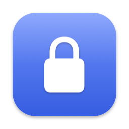

<div align="center">



# MacLock

**A native-style macOS lock screen that unlocks with Touch ID.**

Built for Macs where an MDM profile blocks fingerprint unlock at the system login window —
the `LocalAuthentication` API still works inside a normal app, so your fingerprint works again.

[](https://github.com/haonguyenstech/maclock/releases/latest)
[](https://www.apple.com/macos/)
[-brightgreen)](#build-from-source)
[](LICENSE)

</div>

---

## Install

One line — installs the latest release, removes the Gatekeeper quarantine flag, and launches it:

```bash
curl -fsSL https://raw.githubusercontent.com/haonguyenstech/maclock/master/install.sh | bash
```

> Re-run the same command any time to **update**. Prefer a manual install? Download
> **`MacLock.zip`** from the [latest release](https://github.com/haonguyenstech/maclock/releases/latest),
> unzip, and double-click **`Install.command`**.

### First launch (30 seconds)

1. A **padlock icon** appears in your menu bar.
2. Grant **System Settings → Privacy & Security → Accessibility** for MacLock — this lets it block the
   keyboard while locked. *(Skip it and you can still lock + type your password, but shortcuts aren't blocked.)*
3. **Right-click** the icon → **Settings…** to set your shortcut, dim timer, Dock visibility, and Launch at Login.

---

## Usage

| Action | How |
| --- | --- |
| **Lock now** | Left-click the menu-bar icon, or press the shortcut (default `⌃⌥L`) |
| **Unlock** | Touch the fingerprint sensor — or type your login password and press ↩ |
| **Open settings** | Right-click the icon → **Settings…** |

---

## Features

- 🖥️ **Native-style lock screen** — blurred wallpaper, large clock, avatar, and password field.
- 👆 **Touch ID unlock** — always armed; a single touch wakes the screen *and* unlocks.
- ⌨️ **Password fallback** — type your real login password, verified through the system (PAM / `dscl`).
- 🛡️ **Keyboard & gesture blocking** — a `CGEventTap` swallows every keystroke, scroll, and multi-touch
  swipe (Mission Control / Spaces), and neutralizes hot corners while locked.
- ⚡ **Quick-Lock shortcut** — global hotkey, remappable in Settings.
- 🌙 **Smart dim / blackout** — after an idle timeout MacLock blacks out the display and drops the
  backlight to save power, while holding a power assertion so the **native** lock screen never layers
  on top — you unlock **once**, with Touch ID.
- 🚀 **Launch at Login** and a **menu-bar-only / show-in-Dock** toggle.

---

## Settings

| Setting | What it does |
| --- | --- |
| **Quick-Lock Shortcut** | Record any modifier combo to lock instantly (default `⌃⌥L`). |
| **Show in Dock** | Off = menu-bar-only; On = also show a Dock icon. |
| **Dim Screen After** | Idle time before MacLock blacks out the screen (`Never` / 1 / 2 / 5 / 10 / 15 min). |
| **Launch at Login** | Start MacLock automatically after every restart / login. |

---

## Security note

> [!IMPORTANT]
> MacLock is a **convenience lock**, not a replacement for the system login window.

It runs inside your user session, so it can only *cover and block* — it cannot freeze the session at
the kernel level the way `loginwindow` does. A restart (unless **Launch at Login** is on), SSH, or
Screen Sharing can bypass it. For genuine protection, enable **FileVault** and keep using the native
lock (`⌃⌘Q`) for sensitive data. See the [why](#how-it-works) below.

---

## How it works

- **Touch ID** goes through `LocalAuthentication` (`LAContext` + `deviceOwnerAuthenticationWithBiometrics`),
  which an MDM `allowFingerprintForUnlock=false` profile does **not** block for third-party apps.
- **Input blocking** uses a session-level `CGEventTap` at the head of the event chain; the lock window
  sits above `CGShieldingWindowLevel`, and a 1-second watchdog re-asserts the tap and window if anything
  tries to displace them.
- **Single unlock when idle**: instead of letting macOS sleep the display (which would raise the native
  login window on top), MacLock holds an `IOPMAssertion` and dims the backlight itself via the private
  `DisplayServices` API — so waking always lands on MacLock's own screen.

---

## Build from source

Requires macOS 14+ and the Xcode command-line tools.

```bash
./build.sh      # compile a universal binary → /Applications/MacLock.app (ad-hoc signed)
./release.sh    # package + publish a new GitHub release (maintainer only)
```

To cut a new version: bump `CFBundleShortVersionString` in `Info.plist`, then run `./release.sh`.

---

<div align="center">
<sub>MIT Licensed · Made for Macs stuck behind an MDM Touch-ID block.</sub>
</div>
